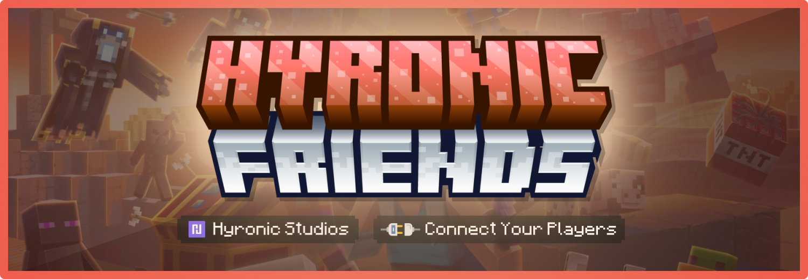

+++
title = "Hyronic Friends"
+++

**HyronicFriends** is a plugin that adds to your friend system. With this plugin, you can send friend requests, receive notifications when your friends are online, teleport instantly to your friends, and most importantly, you can send mail to your friends, including items as attachments.

### Now available on marketplaces

*   **[SpigotMC](https://www.spigotmc.org/resources/111700/)**
*   **[BuiltByBit (MC-Market)](https://builtbybit.com/resources/30517/)**
*   **[Polymart](https://polymart.org/resource/4539)**

### Features

*   Support multiple server versions.
*   Support **MySQL** and **SQLite** database.
*   Support **BungeeCord/Velocity** for cross-server (see [how to setup](./bungee)).
*   Support custom texture for GUI.
*   Support **[Oraxen](https://www.spigotmc.org/resources/72448/)** and **[ItemsAdder](https://www.spigotmc.org/resources/73355/)**.
*   Support multiple languages. You can translate it into your native language.
*   Add (or unfriend) a player.
*   Send an email to your friend. You can also attach your item before sending.
*   Immediately teleport to your friend (BungeeCord/Velocity support).
*   Blocking any player from requesting friend, teleporting, or sending email.
*   Each friend has different permissions. You can set it up on GUI.
*   Manage your friend list (or what your friend can do with you) on GUI.
*   Sending private message to your friend. If your server is BungeeCord, then it will be sent across the server.
*   Quickly reply to the most recent message.
*   Fully customizable.
*   And more...
